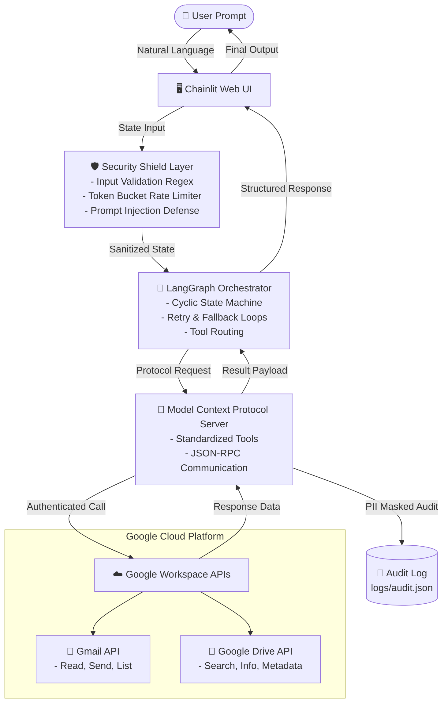

# 🚀 Autonomous Gmail & Google Drive AI Agent (LangGraph + MCP)

[](https://www.python.org/downloads/)
[](https://github.com/langchain-ai/langgraph)
[](https://modelcontextprotocol.io/)
[](#-security-guardrails--rate-limiting)
[](LICENSE)

> **Production-Ready Autonomous AI Agent connecting Gmail & Google Drive to Large Language Models (LLMs) via Anthropic's Model Context Protocol (MCP) and LangGraph state machines.**

---

> [!IMPORTANT]
> **DISCLAIMER**: This repository and project demonstration are strictly intended for **EDUCATIONAL, RESEARCH, AND LEARNING PURPOSES ONLY**. All credentials and API key references are fully sanitized. Always ensure compliance with Google Cloud Terms of Service and data privacy laws (GDPR/CCPA) when deploying in live environments.

---

## 📌 Architecture Diagram



---

## ✨ Key Features & Capabilities

- 🤖 **Autonomous Tool Execution**: Intelligently decides when to read email threads, search Drive documents, or draft email replies based on user intent.
- 🔌 **Decoupled MCP Architecture**: Built on Anthropic's **Model Context Protocol (MCP)** standard—making tools plug-and-play across any MCP-compliant LLM client.
- 🧠 **LangGraph State Orchestration**: Cyclic execution graph featuring state persistence, deterministic tool routing, and automated retry loops.
- 🛡️ **Enterprise Security Shield**:
  - **Token Bucket Rate Limiting**: Max 10 requests/sec ceiling to prevent API quota exhaustion.
  - **Input Validation Regex**: Email format verification, file ID format check, and query parameter length capping (max 256 chars).
  - **PII Masking Audit Logs**: Automatically masks sensitive personal data (`j***@company.com`) before writing to `logs/audit.json`.
  - **Least Privilege OAuth**: Restricted to minimal scopes (`gmail.readonly`, `gmail.send`, `drive.readonly`).

---

## 🛠️ The 6 Exposed MCP Tools

### 📧 Gmail Tools
| Tool | Signature / Parameters | Description |
|---|---|---|
| `list_emails` | `(query: str = "is:unread", max_results: int = 10)` | Search emails matching Gmail query syntax (e.g. `is:unread`, `from:boss@corp.com`). |
| `read_email` | `(email_id: str)` | Fetch full email contents including headers, body payload, thread ID, and snippets. |
| `send_email` | `(to: List[str], subject: str, body: str, cc: List[str] = [], bcc: List[str] = [])` | Construct base64-encoded MIME email and send securely via Gmail API. |

### 📁 Google Drive Tools
| Tool | Signature / Parameters | Description |
|---|---|---|
| `list_drive_files` | `(query: str = "", max_results: int = 10, file_type: str = "")` | List files from Google Drive with optional MIME type filtering. |
| `get_file_info` | `(file_id: str)` | Retrieve file metadata (size, owner, mimeType, modified timestamp). |
| `search_drive` | `(keyword: str, max_results: int = 10)` | Full-text search across file titles and contents in Google Drive. |

---

## 📂 Project Directory Structure

```text
langgraph-mcp-google-workspace/
├── backend/
│   ├── config/
│   │   └── settings.py          # Centralized configuration & environment loader
│   ├── handlers/
│   │   └── tool_handler.py      # Layered tool execution & rate-limit wrapper
│   ├── models/
│   │   └── schemas.py           # Typed Pydantic & dataclass contracts (ToolResult, AuditLog)
│   ├── security/
│   │   ├── audit_logger.py      # PII-masked JSON audit logger
│   │   └── validators.py        # Input validation regex & injection defense
│   ├── services/
│   │   ├── auth_helper.py       # Google OAuth 2.0 / Service Account token manager
│   │   ├── gmail_service.py     # Low-level Gmail REST API wrapper
│   │   └── drive_service.py     # Low-level Drive REST API wrapper
│   ├── chainlit_app.py          # Interactive Web UI for live agent chat
│   ├── langgraph_agent.py       # LangGraph cyclic state machine workflow
│   ├── mcp_server.py            # Primary MCP Protocol Server
│   ├── test_mcp_server.py       # Comprehensive pytest validation suite
│   ├── .env.example             # Complete environment variable template
│   └── requirements.txt         # Dependencies
├── Dockerfile                   # Multi-stage production container build
├── docker-compose.yml           # Local deployment setup
├── README.md                    # Repository documentation
└── SETUP.md                     # Google Cloud credentials setup guide
```

---

## 🚀 Quick Start Guide

### 1. Clone & Setup Environment

```bash
git clone https://github.com/parthibanktech/langgraph-mcp-google-workspace.git
cd langgraph-mcp-google-workspace/backend

# Create virtual environment
python -m venv env

# Activate environment (Windows)
env\Scripts\activate
# Activate environment (Linux/Mac)
# source env/bin/activate

# Install dependencies
pip install -r requirements.txt
```

### 2. Configure Credentials & Environment

1. Obtain a Service Account key from [Google Cloud Console](https://console.cloud.google.com).
2. Enable **Gmail API** and **Google Drive API**.
3. Place the downloaded JSON key as `credential.json` inside the `backend/` directory.
4. Copy `.env.example` to `.env`:

```bash
cp .env.example .env
```

### 3. Run the Chainlit Web UI

```bash
chainlit run chainlit_app.py -w
```
Open your browser at **`http://localhost:8000`** to start chatting with your autonomous agent!

---

## 🧪 Running Tests

To verify that Google credentials and all 6 MCP tools are operational:

```bash
python test_mcp_server.py
```

---

## 📄 License

Distributed under the MIT License. See `LICENSE` for more information.
